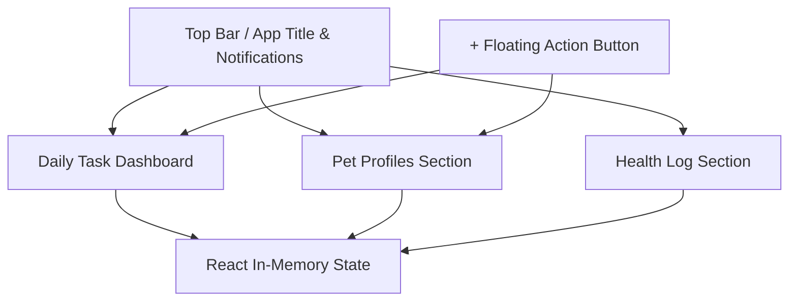

# Requirements Document: PetCarePlanner Main Container

## Overview

The PetCarePlanner Main Container serves as the core user interface for a PetCare scheduling and management application. Built using React.js, it provides users with the ability to manage multiple pet profiles, schedule and track recurring care tasks, maintain a daily dashboard of activities, record health-related events, and receive reminders for important events, all within a dark-themed and visually appealing web interface. The application is strictly frontend-only and runs entirely in the browser, with all data persisted only in memory using React state.

---

## Scope and Objectives

- Deliver a functional web application enabling users to manage the daily and ongoing care of multiple pets.
- Ensure the solution is fully frontend (no backend, databases, or persistent storage).
- Prioritize user experience via a modern, dark-mode UI with accessible navigation and clear task presentation.
- Establish an architectural foundation for possible future backend integration, without integrating any business logic linked to real data persistence or notifications.

---

## Functional Requirements

### 1. Multi-Pet Profiles

- Users can create, read, update, and delete profiles for multiple pets.
- Each profile consists of:
  - Name
  - Species (dog, cat, etc.)
  - Breed (text field)
  - Age (number or date of birth)
  - Photo (optional, local only, no upload)
- Pet profiles are accessible for viewing and editing via a dedicated navigation section or menu.
- All profile data exists in React state and will be lost on browser refresh.

### 2. Recurring Care Task Scheduling

- Users may schedule tasks for each pet, including but not limited to:
  - Feeding
  - Walking
  - Medication administration
- Recurrence options must support:
  - Daily, weekly, and custom recurring timeframes
  - Time(s) of day (per task)
- Tasks are associated with one or more individual pet profiles.
- Editing and deletion of scheduled tasks is available via UI controls.

### 3. Daily Task Dashboard

- The application’s main view displays a summary (“dashboard”) of all tasks due on the current day, grouped or ordered by pet and time.
- Tasks should be shown with relevant details (pet name/photo, task type, scheduled time).
- Users can mark tasks as completed for the day. Completion status persists only until the next reload (in memory only).
- Tasks in the dashboard update based on additions, deletions, or edits elsewhere in the app.

### 4. Health Log

- For each pet, users can record and view a history of health-related events:
  - Vet visits (date, reason, notes)
  - Vaccinations (date, type, notes)
  - Medications administered (date, medication, dose, notes)
  - Free-form health notes
- Events are timestamped and attached to individual pet profiles.
- Health logs are viewable per pet in a dedicated section.

### 5. Reminders & Notifications

- The system provides a UI element (“notification bar”) at the top of the screen to highlight upcoming tasks or important events (e.g., vaccines due soon).
- Visual reminders for tasks/events due “now” or within a short time window are included in the dashboard and notification bar.
- No real device/browser notifications are implemented; reminders/alerts occur only within the UI and session.
- UI for marking reminders as “dismissed” (for the session) is available.

### 6. Main Container Layout & Navigation

- The dashboard (daily task list) is the main/landing screen.
- A persistent top bar includes the app title/logo and the notification bar for reminders and alerts.
- Navigation is provided to access:
  - Daily dashboard
  - Pet profile management (add, view, edit, delete)
  - Health log for each pet
- A floating action button (FAB) is present for quick access to task/pet creation dialogs.
- All navigation, forms, and dialogs are implemented using React components.

---

## Non-Functional Requirements

### 1. Technical Constraints

- Technology: React.js (frontend only)
- Language: JavaScript (ES6+)
- No backend, persistent storage, or API integration allowed.
- All data resides in React component or application state and is lost on browser reload/close.
- UI-based reminders only; no system/browser push notifications, no scheduled jobs.
- Structure, stubbing, component theming, state handling, and sample flows are prioritized over complex business logic.

### 2. Theming & UI

- The application must use dark mode UI throughout.
- Brand color palette:
    - Primary: `#4CAF50` (green)
    - Secondary: `#FFC107` (amber/yellow)
    - Accent: `#2196F3` (blue)
- Theme variables must be defined in top-level CSS and applied consistently.
- Design emphasizes clarity, accessibility, and visual separation between interface sections.

### 3. Accessibility & Responsiveness

- All interactive elements must be accessible with keyboard and screen reader cues where feasible.
- Components, dialogs, and navigation must adapt gracefully to various viewport sizes (responsive design).

### 4. Performance

- The UI must remain responsive for typical use cases (e.g., managing up to 10 pets and several dozen tasks).
- Minimal JavaScript/CSS dependencies; avoid introducing heavy frameworks.

---

## Out of Scope

- Data persistence between sessions (no localStorage, cookies, cloud, or backend use)
- Authentication or user accounts
- Real push notifications or calendar integration
- Mobile app packaging (web only)

---

## Notes for Future Expansion

- Backend persistence (e.g., via API, cloud, or localStorage) may be added later with moderate refactoring.
- Push notification integration would require additional logic and permissions not covered by this scope.
- UX patterns established here should support gradual future feature extension.

---

## Visual Architecture Diagram

---

## Revision History

- 1.0 – Initial requirements specification for PetCarePlanner Main Container (React, web-only)

